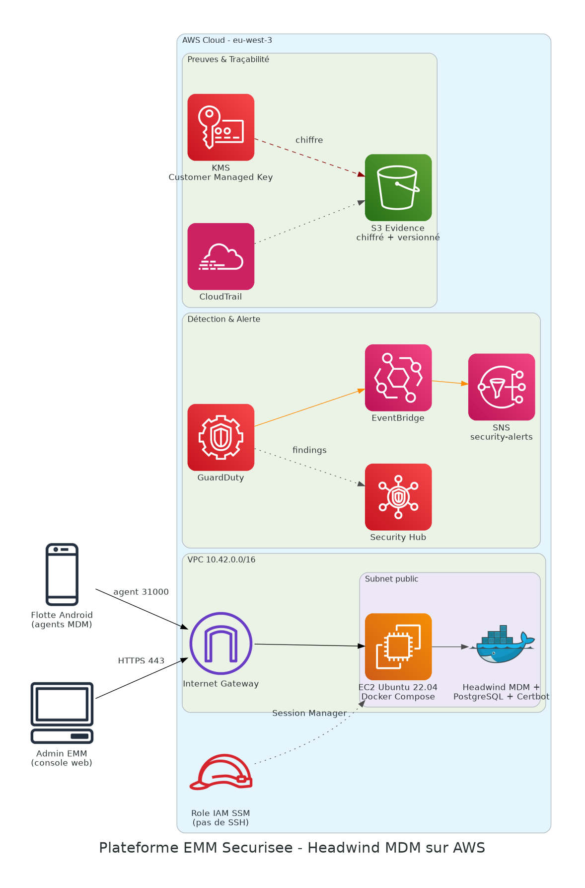
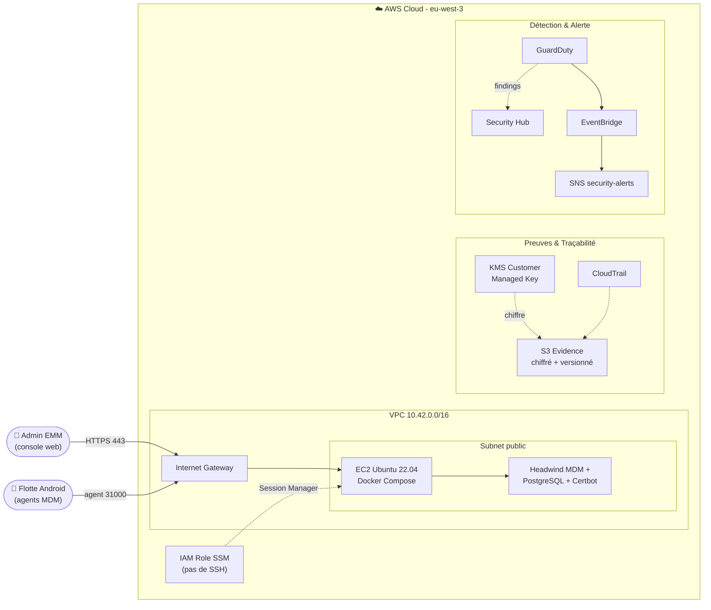

# 📱 Plateforme EMM Sécurisée — Headwind MDM sur AWS

[](https://www.terraform.io/)
[](https://aws.amazon.com/)
[](https://www.docker.com/)
[]()

## 🎯 Objectif du projet

Déployer et administrer une plateforme **EMM (Enterprise Mobility Management)** auto-hébergée
([Headwind MDM](https://h-mdm.com/)) sur AWS, pour gérer et sécuriser une flotte de terminaux
Android d'entreprise : enrôlement par QR code, configurations différenciées (standard / kiosque
/ quarantaine), et sécurité cloud avancée (chiffrement, détection de menaces, traçabilité,
réponse à incident).

> Scénario : une entreprise (« MobilityBank ») équipe ses conseillers terrain de terminaux
> Android et doit pouvoir les inventorier, les configurer, les verrouiller ou les effacer en
> cas de perte, tout en conservant des preuves d'administration exploitables.

## 🏗️ Architecture



<details>
<summary>Voir la version Mermaid (interactive)</summary>


</details>

### Composants clés

| Composant | Rôle |
|---|---|
| **VPC dédié (2 AZ)** | Isolation réseau, subnets publics/privés, Internet Gateway |
| **EC2 Ubuntu 22.04 + Docker Compose** | Héberge Headwind MDM, PostgreSQL et Certbot (certificat Let's Encrypt) |
| **IAM Role + Session Manager** | Administration serveur **sans port SSH exposé** (moindre privilège) |
| **Security Group restreint** | Seuls les ports 80 (validation Let's Encrypt), 443 (console/API) et 31000 (canal agent MDM) sont ouverts |
| **KMS + S3 Evidence** | Stockage chiffré et versionné des preuves d'administration (captures, configs) |
| **CloudTrail** | Traçabilité de toutes les actions effectuées sur le compte AWS |
| **GuardDuty + Security Hub** | Détection de menaces et centralisation des findings de sécurité |
| **EventBridge + SNS** | Alerte automatique par e-mail à chaque finding GuardDuty |

## 📁 Structure du dépôt

```
.
├── terraform/
│   ├── versions.tf
│   ├── variables.tf
│   ├── main.tf            # VPC, EC2, SG, IAM/SSM, KMS, S3, CloudTrail, GuardDuty, Security Hub, SNS/EventBridge
│   └── outputs.tf
├── scripts/
│   ├── install-headwind.sh.tftpl  # User-data EC2 : installe Docker + agent SSM
│   └── deploy-headwind.sh         # A exécuter via Session Manager : génère .env et lance la stack
├── docker-compose.yaml    # Stack Headwind MDM (certbot, postgresql, hmdm)
├── .env.example
├── docs/
│   ├── architecture-diagram.png
│   └── runbook-incident.md   # Procédure de réponse à un appareil perdu
└── README.md
```

## 🚀 Déploiement

### 1. Infrastructure AWS (Terraform)

```bash
git clone https://github.com/BakirAhmed/secure-emm-platform-headwind-mdm.git
cd secure-emm-platform-headwind-mdm/terraform

terraform init
terraform apply
terraform output mdm_public_ip
```

### 2. Démarrage de Headwind MDM (via Session Manager, pas de SSH)

Dans la console AWS → EC2 → sélectionner l'instance → **Connect → Session Manager**, puis :

```bash
sudo -i
cd /opt/headwind-mdm
PUBLIC_IP="<sortie terraform mdm_public_ip>" ADMIN_EMAIL="formation@example.invalid" \
  bash /opt/headwind-mdm/deploy-headwind.sh

docker compose pull
docker compose up -d
docker compose ps
```

Une fois la console accessible en HTTPS et le premier login effectué :

```bash
sed -i 's/^FORCE_RECONFIGURE=true/FORCE_RECONFIGURE=false/' .env
docker compose restart hmdm
```

### 3. Paramétrage Headwind MDM

1. Se connecter à `https://<mdm_public_ip>.sslip.io` et **changer immédiatement le mot de passe admin**.
2. Créer les configurations : `CFG-BASE-CORP` (usage standard), `CFG-KIOSK-DEMO` (mode terminal dédié), `CFG-QUARANTAINE` (appareil perdu/non conforme).
3. Générer un QR code d'enrôlement pour `CFG-BASE-CORP` et enrôler un appareil Android (factory reset) ou documenter la simulation si aucun terminal n'est disponible.

## 🧠 Points techniques abordés

- **Administration sans SSH** : accès exclusivement via AWS Systems Manager Session Manager (rôle IAM `AmazonSSMManagedInstanceCore`)
- **Défense en profondeur réseau** : Security Group minimal (3 ports), VPC dédié, aucune exposition inutile
- **Chiffrement et gouvernance des preuves** : bucket S3 SSE-KMS + versioning pour l'auditabilité
- **Visibilité CASB-like** : CloudTrail (traçabilité), GuardDuty (détection), Security Hub (posture), SNS/EventBridge (alerte)
- **Gestion de flotte EMM** : configurations différenciées, conventions de nommage, conformité, cycle de vie applicatif
- **Réponse à incident** : procédure structurée de mise en quarantaine d'un appareil perdu (voir `docs/runbook-incident.md`)

## 📸 Preuves de déploiement

*(À compléter : capture de l'instance EC2 avec rôle IAM, capture Security Hub / GuardDuty findings,
capture de la console Headwind avec les 3 configurations, QR code d'enrôlement, capture du bucket
S3 evidence chiffré.)*

## 🔮 Améliorations futures (piste production)

- [ ] Remplacer l'EC2 publique + PostgreSQL conteneurisé par une architecture ALB + instance privée + RDS Multi-AZ
- [ ] Terminaison TLS via ACM + ALB au lieu de Certbot local
- [ ] Fédération d'identité / SSO + MFA pour les comptes administrateurs Headwind
- [ ] Sauvegardes automatisées (snapshots EBS, réplication S3)
- [ ] WAF ou AWS Verified Access en amont de la console MDM

## 👤 Auteur

**Ahmed Bakir** — Étudiant Ingénieur Réseaux & Cloud (EPSI Lyon / ENIG)
[LinkedIn](https://linkedin.com/in/ahmed-bk) · [GitHub](https://github.com/BakirAhmed)
